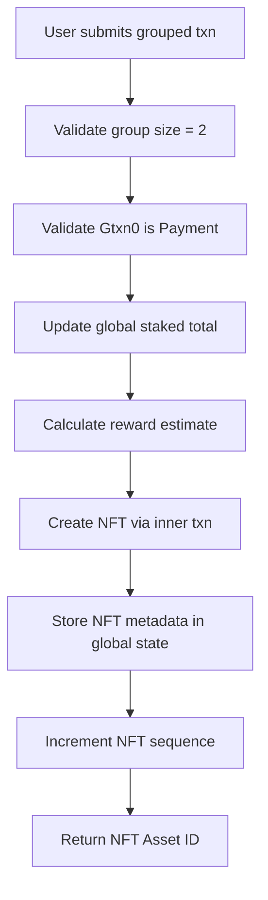
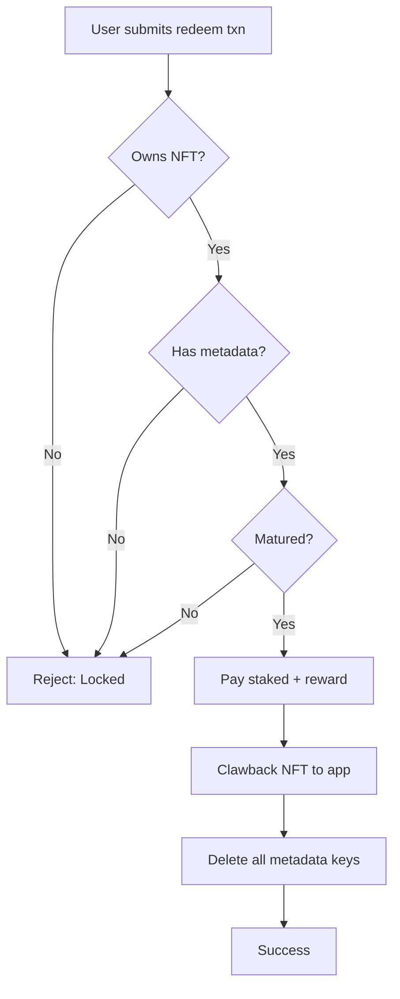

# 🏗️ Architecture Documentation

Technical documentation for developers contributing to or understanding the NaanFI staking platform.

## Table of Contents
- [System Overview](#system-overview)
- [Smart Contract Architecture](#smart-contract-architecture)
- [Frontend Architecture](#frontend-architecture)
- [Data Flow](#data-flow)
- [Storage Schema](#storage-schema)
- [Security Considerations](#security-considerations)

---

## System Overview

### Tech Stack

**Smart Contract Layer:**
- **Language**: PyTeal 0.19.0
- **Blockchain**: Algorand TestNet
- **AVM Version**: 6
- **Deployment Tool**: py-algorand-sdk 2.2.0

**Frontend Layer:**
- **Framework**: Next.js 16.0.0 (App Router)
- **UI Library**: React 19.2.0
- **Language**: TypeScript 5.x
- **Styling**: Tailwind CSS + shadcn/ui
- **Wallet**: Pera Wallet Connect 1.4.2
- **Blockchain SDK**: algosdk 3.5.2

### Component Architecture

```
┌─────────────────────────────────────────────────────────────┐
│                        User Wallet                           │
│                     (Pera Wallet)                            │
└────────────────────┬────────────────────────────────────────┘
                     │
                     │ WalletConnect
                     │
┌────────────────────▼────────────────────────────────────────┐
│                    Frontend (Next.js)                        │
│  ┌──────────────┬──────────────┬──────────────┬──────────┐ │
│  │   Stake      │  Claim NFT   │   Unstake    │   FAQ    │ │
│  │   Page       │    Page      │    Page      │   Page   │ │
│  └──────────────┴──────────────┴──────────────┴──────────┘ │
│                                                              │
│  ┌──────────────────────────────────────────────────────┐  │
│  │         WalletContext (Global State)                  │  │
│  └──────────────────────────────────────────────────────┘  │
└────────────────────┬────────────────────────────────────────┘
                     │
                     │ algosdk API calls
                     │
┌────────────────────▼────────────────────────────────────────┐
│              Algorand TestNet Node                           │
│                (algonode.cloud)                              │
└────────────────────┬────────────────────────────────────────┘
                     │
┌────────────────────▼────────────────────────────────────────┐
│                  Smart Contract                              │
│              (PyTeal → TEAL → AVM)                          │
│                                                              │
│  ┌──────────┬──────────┬──────────┬──────────┬──────────┐  │
│  │  stake   │ claim_nft│  redeem  │ withdraw │ opt_in   │  │
│  └──────────┴──────────┴──────────┴──────────┴──────────┘  │
└──────────────────────────────────────────────────────────────┘
```

---

## Smart Contract Architecture

### File Structure

```
src/
├── staking_app.py        # Main PyTeal contract
├── approval.teal         # Compiled approval program
└── clear.teal           # Compiled clear state program
```

### Contract Operations

#### 1. Creation (Initialize)

**Transaction Type**: `ApplicationCall` (creation)

**Actions:**
- Initializes global state variables
- Sets reward asset ID (if provided)
- Sets NFT sequence counter to 0

**Global State Initialized:**
```python
GLOBAL_TOTAL_STAKED = 0      # Total microALGO staked
GLOBAL_REWARD_PER_SHARE = 0  # Reward calculation base
GLOBAL_LAST_UPDATE = now     # Timestamp
GLOBAL_REWARD_ASSET = <id>   # ASA for rewards
GLOBAL_NFT_SEQ = 0           # NFT numbering
```

#### 2. Opt-In (User Registration)

**Transaction Type**: `ApplicationCall` (opt-in)

**Actions:**
- User registers with the application
- Initializes local state for user

**Local State Initialized:**
```python
LOCAL_STAKED = 0      # User's staked amount
LOCAL_REWARD_DEBT = 0 # Reward accounting
```

#### 3. Stake Operation

**Transaction Type**: Grouped transaction
- Transaction 0: `Payment` to app address
- Transaction 1: `ApplicationCall` with "stake" arg

**Input:**
```typescript
Txn.application_args[0] = "stake"
Txn.application_args[1] = <lock_period_seconds>  // 30/60/90 days
Gtxn[0].amount = <microALGOs_to_stake>
```

**Process Flow:**


**Global State Keys Created:**
```python
"NFT_OWNER_" + Itob(assetId)  → Txn.sender()       # Owner address
"NFT_S_" + Itob(assetId)      → staked_amount      # microALGOs
"NFT_P_" + Itob(assetId)      → lock_period        # seconds
"NFT_ST_" + Itob(assetId)     → start_time         # Unix timestamp
"NFT_R_" + Itob(assetId)      → reward_estimate    # microALGOs
```

**APR Calculation:**
```python
if period == 30 days: apr = 5%
if period == 60 days: apr = 7%
if period == 90 days: apr = 10%

reward = (staked_amount × apr × period) / (365 days)
```

#### 4. Claim NFT Operation

**Transaction Type**: `ApplicationCall` with "claim_nft" arg

**Input:**
```typescript
Txn.application_args[0] = "claim_nft"
Txn.assets[0] = <nft_asset_id>
```

**Prerequisites:**
1. User must have opted into the NFT asset
2. User must be the stored owner (`NFT_OWNER_<assetId>`)

**Process:**
1. Verify user has opted into asset (AssetHolding check)
2. Verify ownership mapping matches caller
3. Transfer NFT from app to user via inner transaction
4. Delete ownership mapping (`NFT_OWNER_` key)

#### 5. Redeem Operation

**Transaction Type**: `ApplicationCall` with "redeem" arg

**Input:**
```typescript
Txn.application_args[0] = "redeem"
Txn.assets[0] = <nft_asset_id>
```

**Validation Checks:**
```python
Assert(user holds NFT)                     # AssetHolding >= 1
Assert(metadata exists)                    # NFT_S_ key exists
Assert(position matured)                   # now >= start + period
```

**Process Flow:**


**Maturity Check (pc=628):**
```python
# This is the assertion that causes "assert failed pc=628"
Assert(Global.latest_timestamp() >= (start_time + lock_period))
```

**Assets Returned:**
```python
inner_payment_amount = staked_amount + reward_estimate
```

**Cleanup:**
```python
App.globalDel("NFT_S_" + assetId)
App.globalDel("NFT_P_" + assetId)
App.globalDel("NFT_ST_" + assetId)
App.globalDel("NFT_R_" + assetId)
```

### State Schema

**Global State:**
```python
GlobalStateSchema(
    num_uints=48,        # 48 uint64 values
    num_byte_slices=16   # 16 byte slices
)
# Total = 48 + 16 = 64 (Algorand max)
```

**Local State:**
```python
LocalStateSchema(
    num_uints=4,         # 4 uint64 values
    num_byte_slices=4    # 4 byte slices
)
```

**Capacity:**
- Max ~10-12 concurrent positions (48 uints - 5 base globals = ~43 / 4 per position)
- Production should use Boxes for unlimited scaling

### Key Encoding

Asset IDs are stored as **8-byte big-endian** via PyTeal's `Itob()`:

```python
# PyTeal
key = Concat(Bytes("NFT_S_"), Itob(assetId))

# Results in binary key:
# "NFT_S_" (6 bytes) + assetId (8 bytes big-endian)
```

**Frontend Decoding:**
```typescript
const keyBuffer = Buffer.from(kv.key, 'base64')
const prefix = keyBuffer.slice(0, 6).toString('utf8')  // "NFT_S_"
const assetIdBytes = keyBuffer.slice(6)                 // 8 bytes
const assetId = Number(BigInt('0x' + assetIdBytes.toString('hex')))
```

---

## Frontend Architecture

### Directory Structure

```
frontend/
├── app/
│   ├── layout.tsx                 # Root layout with providers
│   ├── page.tsx                   # Home/landing page
│   ├── stake/
│   │   └── page.tsx               # Stake ALGO page
│   ├── claim-nft/
│   │   └── page.tsx               # Claim NFT page
│   ├── claim/
│   │   └── page.tsx               # Unstake/redeem page
│   └── faq/
│       └── page.tsx               # FAQ page
│
├── components/
│   ├── wallet-context.tsx         # Global wallet state
│   ├── wallet-button.tsx          # Connect wallet UI
│   ├── navbar.tsx                 # Navigation bar
│   ├── footer.tsx                 # Footer with links
│   │
│   ├── staking-form.tsx           # Stake ALGO form
│   ├── staking-stats.tsx          # Stats display
│   │
│   ├── claim-nft-form.tsx         # 2-step NFT claim
│   ├── claim-nft-help.tsx         # Help sidebar
│   │
│   ├── claim-form.tsx             # Redeem form
│   ├── user-staking-positions.tsx # Position list
│   │
│   └── ui/                        # shadcn/ui components
│       ├── button.tsx
│       ├── card.tsx
│       ├── input.tsx
│       └── ...
│
├── lib/
│   ├── algorandEncode.ts          # Transaction encoding utils
│   └── utils.ts                   # General utilities
│
├── app_state.json                 # Contract deployment IDs
├── package.json
└── tsconfig.json
```

### State Management

#### Wallet Context (Global State)

**File**: `components/wallet-context.tsx`

**Provides:**
```typescript
interface WalletContextType {
  isConnected: boolean
  walletAddress: string | null
  connect: () => Promise<string | null>
  disconnect: () => void
  signTransactions: (txns: Transaction[][]) => Promise<any>
}
```

**Usage:**
```typescript
const { isConnected, walletAddress, connect, signTransactions } = useWallet()
```

#### Component-Level State

Each form component maintains its own local state:

```typescript
// Example: StakingForm
const [amount, setAmount] = useState<string>("")
const [lockPeriod, setLockPeriod] = useState<number>(30)
const [isProcessing, setIsProcessing] = useState(false)
const [statusMessage, setStatusMessage] = useState<string | null>(null)
const [createdAssetId, setCreatedAssetId] = useState<number | null>(null)
```

### Transaction Construction

#### Pattern: Robust Transaction Building

All transaction construction follows this pattern to handle SDK variations:

```typescript
// 1. Get transaction params
const rawParams = await algodClient.getTransactionParams().do()

// 2. Sanitize params (BigInt → Number)
const params = { ...rawParams }
if (typeof params.fee === 'bigint') params.fee = Number(params.fee)

// 3. Try high-level constructor
let txn
try {
  txn = algosdk.makeApplicationNoOpTxnFromObject({
    from: addr,
    suggestedParams: params,
    appIndex: appId,
    appArgs: [arg],
    foreignAssets: [assetId]
  })
} catch (err) {
  // 4. Fallback to Transaction constructor
  const TxConstructor = algosdk.Transaction
  txn = new TxConstructor({
    type: 'appl',
    sender: addr,
    suggestedParams: params,
    // ... other fields
  })
}

// 5. Encode for signing
const unsigned = algosdk.encodeUnsignedTransaction(txn)
const unsignedB64 = uint8ArrayToBase64(unsigned)

// 6. Sign via wallet
const signed = await signTransactions([[unsignedB64]])

// 7. Parse signature (handles multiple formats)
const signedBlobs = normalizeSignatures(signed)

// 8. Send to network
const result = await algodClient.sendRawTransaction(signedBlobs).do()
```

#### Signature Normalization

**Problem**: Different wallet implementations return signatures in different formats.

**Solution**: Comprehensive parsing function:

```typescript
function normalizeSignatures(signed: any): Uint8Array[] {
  const blobs: Uint8Array[] = []
  
  if (!signed) throw new Error('No signed transactions')
  
  if (Array.isArray(signed)) {
    for (const item of signed) {
      if (item instanceof Uint8Array) blobs.push(item)
      else if (typeof item === 'string') blobs.push(base64ToUint8Array(item))
      else if (item?.blob) blobs.push(base64ToUint8Array(item.blob))
      else if (Array.isArray(item)) {
        // Handle nested arrays (WalletConnect mobile)
        for (const nested of item) {
          // ... recursive handling
        }
      }
    }
  } else if (signed.signedTransactions) {
    // Handle {signedTransactions: [...]} wrapper
    blobs.push(...normalizeSignatures(signed.signedTransactions))
  } else if (signed instanceof Uint8Array) {
    blobs.push(signed)
  }
  
  if (blobs.length === 0) throw new Error('No valid signatures parsed')
  return blobs
}
```

### Data Fetching: Position Loading

**Component**: `UserStakingPositions.tsx`

**Algorithm:**

```typescript
async function fetchPositions() {
  // Step 1: Get user's owned NFTs
  const accountInfo = await algodClient.accountInformation(walletAddress).do()
  const userAssets = accountInfo.assets.map(a => a['asset-id'])
  
  // Step 2: Get app global state
  const appInfo = await algodClient.getApplicationByID(appId).do()
  const globalState = appInfo.params['global-state']
  
  // Step 3: Parse metadata for each asset ID
  const nftMetadata = {}
  for (const kv of globalState) {
    const keyBuffer = Buffer.from(kv.key, 'base64')
    const prefix = keyBuffer.slice(0, 6).toString('utf8')
    
    if (prefix.startsWith('NFT_')) {
      const prefixLen = prefix === 'NFT_ST_' ? 7 : 6
      const assetIdBytes = keyBuffer.slice(prefixLen)
      const assetId = Number(BigInt('0x' + assetIdBytes.toString('hex')))
      
      if (!nftMetadata[assetId]) nftMetadata[assetId] = {}
      
      if (prefix === 'NFT_S_') nftMetadata[assetId].stakedAmount = kv.value.uint
      if (prefix === 'NFT_P_') nftMetadata[assetId].lockPeriod = kv.value.uint
      if (prefix === 'NFT_ST_') nftMetadata[assetId].startTime = kv.value.uint
      if (prefix === 'NFT_R_') nftMetadata[assetId].estimatedReward = kv.value.uint
    }
  }
  
  // Step 4: Match owned NFTs with metadata
  const positions = []
  for (const assetId of userAssets) {
    const meta = nftMetadata[assetId]
    if (meta?.stakedAmount && meta?.lockPeriod && meta?.startTime) {
      const now = Math.floor(Date.now() / 1000)
      const endTime = meta.startTime + meta.lockPeriod
      const isMatured = now >= endTime
      
      positions.push({
        assetId,
        stakedAmount: meta.stakedAmount / 1_000_000,  // µALGO → ALGO
        lockPeriod: meta.lockPeriod / 86400,          // seconds → days
        isReady: isMatured,
        daysRemaining: Math.ceil((endTime - now) / 86400),
        // ...
      })
    }
  }
  
  return positions
}
```

**Why This Works:**
- ✅ Only shows NFTs the user actually owns (intersection of wallet assets + metadata)
- ✅ Handles binary key encoding correctly
- ✅ Validates all required metadata fields exist
- ✅ Calculates maturity status client-side for instant feedback

---

## Data Flow

### Stake Flow (Complete)

```
User Input (Amount + Period)
         ↓
Frontend constructs grouped transaction:
  - Txn[0]: Payment(user → app, amount)
  - Txn[1]: AppCall("stake", period)
         ↓
Pera Wallet prompts user
         ↓
User approves → Wallet signs both txns
         ↓
Frontend sends signed group to network
         ↓
Smart Contract executes:
  1. Validates group structure
  2. Updates global staked total
  3. Calculates reward estimate
  4. Creates NFT via inner transaction
  5. Stores metadata in global state
  6. Returns success
         ↓
Frontend extracts created Asset ID from logs
         ↓
Displays Asset ID to user + link to Claim NFT page
         ↓
User saves Asset ID (critical!)
```

### Claim NFT Flow (2-Step)

```
Step 1: Opt-in
─────────────────
User enters Asset ID
         ↓
Frontend constructs: AssetTransfer(amount=0)
         ↓
Wallet signs
         ↓
Network confirms
         ↓
User now "accepts" the asset
         ↓
Step 2: Claim
─────────────────
Frontend constructs: AppCall("claim_nft", assetId)
         ↓
Smart Contract validates:
  - User has opted in (AssetHolding exists)
  - User is stored owner (NFT_OWNER_ key matches)
         ↓
Contract executes inner transfer: app → user
         ↓
Deletes ownership mapping
         ↓
NFT now in user's wallet
```

### Redeem Flow

```
User navigates to Unstake page
         ↓
Frontend fetches:
  - User's assets (accountInformation)
  - App global state (getApplicationByID)
         ↓
Matches owned NFTs with metadata
         ↓
Displays position cards with maturity status
         ↓
User clicks "Use Asset ID to Redeem"
         ↓
Asset ID auto-fills in form
         ↓
Frontend performs pre-check:
  - Fetches start time + lock period
  - Calculates maturity
  - Shows error if locked
         ↓
If matured, user clicks "Redeem"
         ↓
Frontend constructs: AppCall("redeem", assetId)
         ↓
Smart Contract validates (pc=628):
  Assert(now >= start + period)
         ↓
Contract executes:
  1. Inner payment: staked + reward → user
  2. Inner clawback: NFT → app
  3. Deletes all metadata keys
         ↓
User receives ALGO + reward
NFT removed from circulation
Position deleted from contract
```

---

## Storage Schema

### Smart Contract Global State

| Key Pattern | Type | Example | Description |
|-------------|------|---------|-------------|
| `TS` | uint | `50000000000` | Total staked (microALGOs) |
| `RPS` | uint | `0` | Reward per share (scaled) |
| `LU` | uint | `1699824000` | Last update timestamp |
| `RA` | uint | `749736840` | Reward asset ID |
| `NS` | uint | `5` | NFT sequence counter |
| `RR` | uint | `0` | Reward rate |
| `NFT_OWNER_<id>` | bytes | `<address>` | Original staker address |
| `NFT_S_<id>` | uint | `10000000` | Staked amount (µALGO) |
| `NFT_P_<id>` | uint | `2592000` | Lock period (seconds) |
| `NFT_ST_<id>` | uint | `1699824000` | Start timestamp |
| `NFT_R_<id>` | uint | `410958` | Reward estimate (µALGO) |

**Note**: `<id>` is 8-byte big-endian encoded asset ID

### Frontend Local Storage

| Key | Type | Example | Description |
|-----|------|---------|-------------|
| `lastStakeAsset` | string | `"749745123"` | Last staked NFT ID |
| `walletAddress` | string | `"ABC...XYZ"` | Connected address |
| (Pera Wallet keys) | various | - | WalletConnect session data |

---

## Security Considerations

### ⚠️ Known Limitations (TestNet POC)

1. **No Asset Destruction**
   - Redeemed NFTs are clawed back to app, not destroyed
   - Production should use asset destruction to remove from circulation

2. **Limited Capacity**
   - Global state limited to ~10-12 concurrent positions
   - Production needs Box storage for unlimited positions

3. **No Marketplace Escrow**
   - UI has marketplace mockup, but no actual trading logic
   - Production needs atomic swap LogicSig or escrow contract

4. **Simple APR Model**
   - Fixed APR tiers, no dynamic adjustment
   - No compound interest
   - Rewards paid from contract balance, not staking yield

5. **No Upgrade Path**
   - Contract immutable once deployed
   - Production needs upgrade mechanism or proxy pattern

### 🔒 Security Best Practices Implemented

1. **Atomic Operations**
   - Stake uses grouped transactions (atomic)
   - No partial failures

2. **Ownership Verification**
   - AssetHolding checks before redemption
   - Contract validates NFT ownership on-chain

3. **Maturity Enforcement**
   - Lock period enforced by smart contract (pc=628)
   - Cannot be bypassed client-side

4. **No Reentrancy**
   - State updates before external calls
   - Inner transactions are isolated

5. **Input Validation**
   - All amounts validated (> 0)
   - Proper type checks on arguments

### 🎯 Production Recommendations

**Before MainNet deployment:**

1. **Security Audit**
   - Professional smart contract audit
   - Penetration testing
   - Economic modeling review

2. **Implement Boxes**
   - Unlimited position storage
   - Per-user box allocation

3. **Add Emergency Controls**
   - Pause mechanism
   - Admin recovery functions
   - Upgrade capability

4. **Enhanced Testing**
   - Unit tests for all contract functions
   - Integration tests for full flows
   - Fuzz testing for edge cases

5. **Economic Security**
   - Separate reward pool contract
   - Insurance fund for edge cases
   - Rate limiting on operations

6. **User Protections**
   - Slippage protection
   - Front-running mitigation
   - Oracle-based reward calculation

---

## API Reference

### Algorand Node API

**Base URL**: `https://testnet-api.algonode.cloud`

**Key Endpoints Used:**

```
GET  /v2/status                       # Network status
GET  /v2/transactions/params          # Get suggested params
POST /v2/transactions                 # Submit transaction
GET  /v2/transactions/pending/{txid}  # Check transaction status
GET  /v2/accounts/{address}           # Get account info
GET  /v2/applications/{id}            # Get application state
```

### Smart Contract Methods

| Method | Args | Foreign Assets | Description |
|--------|------|----------------|-------------|
| `stake` | `[period_seconds]` | - | Stake ALGO, mint NFT |
| `claim_nft` | - | `[nft_id]` | Transfer NFT to claimer |
| `redeem` | - | `[nft_id]` | Burn NFT, return stake+reward |
| `withdraw` | `[amount]` | - | Withdraw from local state (legacy) |
| `claim` | - | - | Claim rewards only (legacy) |
| `opt_in_asset` | - | `[asset_id]` | App opts into asset |
| `set_params` | `[asset_id, rate]` | - | Admin: set reward params |

---

**Last Updated**: 2025-01-16  
**Contract Version**: v1.0 (App ID: 749737169)  
**AVM Version**: 6
